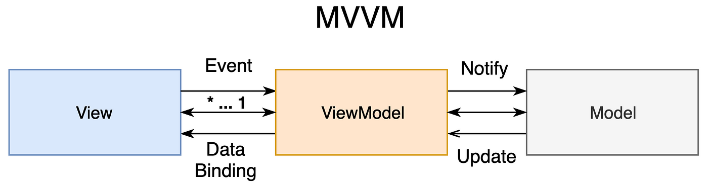

# CatsToAdopt App

## Overview

CatsToAdopt, also known simply as "Cats," is an iOS application designed for cat lovers seeking to adopt a feline friend. It showcases a list of cats, each with its current adoption status - either "Available" or "Adopted." Users can tap on a cat to get more details in a dedicated view.

## Features

- **Cat Gallery**: Explore a list of adorable cats looking for a home.
- **Adoption Status**: Easily see whether a cat is available for adoption or has already found a forever home.
- **Detailed Profiles**: Tap on a cat to view more details about its personality, history, and needs.

## Architecture

CatsToAdopt adopts the Model-View-ViewModel (MVVM) pattern. This architectural approach separates the application logic from the user interface, facilitating a more organized development process and a codebase that's ready to grow.

### MVVM Diagram

### Folder Structure

- `Model`: Contains the data definitions for cat profiles and adoption status.
- `View`: Manages the user interface components and presents the cat profiles.
- `ViewModel`: Serves as a bridge between the Model and the View, updating the user interface based on the cat data.
- `Network`: Handles the networking logic to fetch cat data from a remote server or API.
- `Database`: Manages data persistence for offline access and bookmarking favorite cats.
- `Helpers`: Includes various utility classes and extensions to assist in common tasks throughout the app.

## Installation

To get started with CatsToAdopt:

1. Clone or download the repository.
2. Run `pod install` in your console.
2. Open `Cats.xcworkspace` in Xcode.
3. Compile and run the application on your iOS device or simulator of choice.

## Usage

When you launch Cats, you'll be greeted with a list of cats. Select any cat to view its detailed profile, including photos and information about how to proceed with the adoption.

## Contributing

Your contributions are welcome! If you have ideas for improving CatsToAdopt or want to fix a bug, please fork the repository, make your changes, and submit a pull request.

